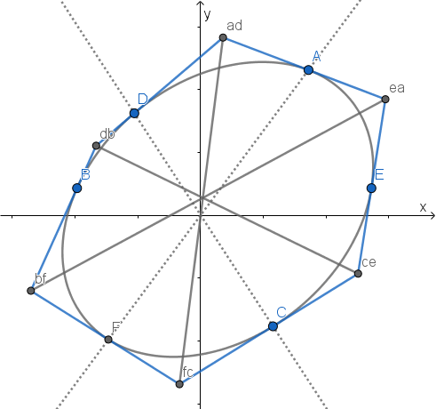

**Brianchon's theorem** states that when a hexagon is circumscribed around a conic section, its principal diagonals (those connecting opposite vertices) meet in a single point. [1]

### The Proof

Let's put point *A*(*g*,0) onto positive x-axis, put points *C*(*h*,0) and *E*(*j*,0) onto y-axis, and donate the conic as:

#### Step 1

To find a line  through a given point *P* tangent to a conic, the following equations should have a repeated root:

where .

So the [discriminant](https://en.wikipedia.org/wiki/Quadratic_equation#Discriminant) of the quadratic equation (*y* is eliminated):

should be 0, which means:

Then we solve *k*12 and get 2 lines .

However, SymPy won't tell us whether the first root denotes the straight line in the left or right side. So we need to guess then verify by numerical evaluation.

Assume the conic is  and 3 points are *A*(5/4,0), *C*(0,5/4) and *E*(0,-5/4). We should get *AB* with negative *k* and *AF* with positive *k*. So we should use `AB, AF = solve(...)` but not `AF, AB = solve(...)`.

[Here](projective/brianchon1.py) we get 6 edges of the hexagon:

where:

If *S* is imaginary, we can flip all coefficients of the conic to guarantee a real *S*. Under this circumstance, imaginary *P*, *Q* or *R* means the tangent line doesn't exist. For example, imaginary *R* means *A* may be inside an ellipse.

### Notes

1. Here we use the diagram from [百度百科](https://baike.baidu.com/item/%E5%B8%83%E5%88%A9%E5%AE%89%E6%A1%91%E5%AE%9A%E7%90%86).