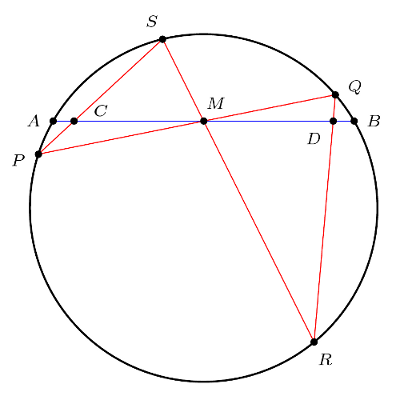
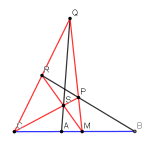

The **butterfly theorem** can be stated as: Let *M* be the midpoint of a chord *AB* of a circle, through which two other chords *PQ* and *RS* are drawn; *PS* and *QR* intersect chord *AB* at *C* and *D* correspondingly. Then *M* is the midpoint of *CD*. [1]

This theorem can be generalized in two forms:

1. Generalize the circle to any conic curve;
2. Generalize the condition *MA* = *MB* and *MC* = *MD* to  or .

### Proof by Analytic Geometry

Here we try to prove the combination of 2 generalized forms. [2]

We put *M* onto the origin of Cartesian coordinates and *B* onto positive x-axis.

#### Step 1

The conic curve *APRBQS* can be represented as:

(Let's assume *M* not on the curve so that *f* ≠ 0.)

The coordinates of *A* and *B* are:

Make *y* = 0 then we get . So *x*A and *x*B are two roots of this equation.

Then we get:

#### Step 2a

The coordinates of *C* and *D* can be calculated by:

Let's assume that neither *PQ* nor *RS* is perpendicular to *AB*, then *PQ* and *RS* can be represented as *y* = *qx* and *y* = *rx*. (We also assume *PQ* and *RS* not coinciding so that *q* ≠ *r*.)

(The case either *PQ* or *RS* perpendicular to *AB* will be proven in Step 2b.)

Then all y-coordinates can be replaced with 0 or x-coordinates:

We solve *x*C and *x*D as:

(Here *x*C and *x*D should exist because *y*P ≠ *y*S and *y*Q ≠ *y*R.)

Then we get:

#### Step 3a

Note that *x*P and *x*Q are two roots of equations:

So we have:

where . (Here we don't consider *Q* = 0 because the line intersects the curve at two different points.)

Similarly, we have:

where .

Finally, we get:

#### Step 2b

If *RS* is perpendicular to *AB*, we can still use Eq. 2a but keep *y*R and *y*R not replaced:

We solve *x*C and *x*D as:

(Here *x*C and *x*D should exist because *y*P ≠ *y*S and *y*Q ≠ *y*R.)

Then we get:

#### Step 3b

Note that *y*R and *y*S are two roots of equations:

So we have:

And we still have Eq. 3a.

Finally, we get:

### Degenerate Conic Curve

The generalized butterfly theorem still holds if the conic curve is degenerated to two lines.

In the below special case, *CD* is a chord of two lines *CNM* and *DKL*, and *B* is a point on *CD*, through which two other lines *BKM* and *BNL* are drawn; *LM* and *NK* intersect chord *CD* at the same point *A* (lines *LM*, *NK* and *CD* are concurrent at point *A*).

According to the generalized butterfly theorem:

In another word, (*A*, *B*) and (*C*, *D*) are [harmonic conjugates](https://en.wikipedia.org/wiki/Projective_harmonic_conjugate): [3]

### Notes

1. Here we use the diagram from [Mathoman's website](http://www.mathoman.com/de/index.php/1529-verschiedene-sehnen-in-einem-kreis). The [diagram](https://en.wikipedia.org/wiki/File:Butterfly_theorem.svg) from [Wikipedia](https://en.wikipedia.org/wiki/Butterfly_theorem) is wrong because M is not the midpoint of PQ and XY.

2. A similar proof (but not generalized forms) can be found [here](https://www.cut-the-knot.org/pythagoras/Butterfly.shtml) (Proof 18).

3. A simple proof of projective harmonic conjugate can be found [here](https://www.imomath.com/index.php?options=628) (Problem 1).