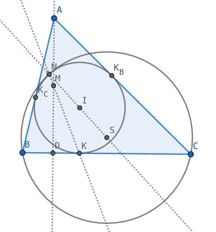

Many contest geometry problems can be solved in analytic ways. Here are some examples.

### A circle divided into 8 regions

> Let *K* be the point *K* in the interior of the unit circle. The circle is divided into 8 regions using four lines passing through *K* such that each two adjacent lines form an angle of 45°, as shown in the picture. Four of these regions are colored such that no two colored regions share more than one point. Prove that the area of the colored regions is exactly half the area of the circle. [1]

Areas can be calculated by integration. Cartesian coordinates may work but we need to divide this figures into too many pieces and calculate them one by one. Here we'd like to use polar coordinates.

Put *K* onto origin and rotate the diameter through *K* (by an angle ) onto polar axis (x-axis), then the circle denoted in Cartesian coordinates  can be written in polar coordinates (just substitute by  and ):

Either positive or negative root is okay.

The area of each part is:

The result doesn't look analytic. Fortunately, the diagonal two parts can be calculated together because:

After some calculations, we have:

Finally, we get:

 □

### Tangency of an incircle and a circumcircle

Most contest geometry problems are too complicated to solve by coordinate approach by hand. However, some of them can be solved with help of computer softwares or programs. Here are some simple examples:

- [IMO 2003 Shortlist G4](pythagoras/imo-2003-shortlist-g4.py)
- [Duke 2012 Putnam preparation, Homework 6: Geometry, Problem 6](pythagoras/duke-putnam-2012-homework-6-6.py)
- [Duke 2012 Putnam preparation, Homework 6: Geometry, Problem 7](pythagoras/duke-putnam-2012-homework-6-7.py)

Although computational approaches are not allowed in math contest, there are a lot of fun in solutions. [Here](https://math.stackexchange.com/a/4257734/919440) is a complicated example solved by [Barycentric coordinates](https://en.wikipedia.org/wiki/Barycentric_coordinate_system). Next, we'd like to use Cartesian coordinates to solve the problem.

> The incircle Ω of the acute-angled triangle *ABC* is tangent to *BC* at *K*. Let *AD* be an altitude of triangle *ABC* and let *M* be the midpoint of *AD*. If *N* is the other common point of Ω and *KM*, prove that Ω and the circumcircle of triangle *BCN* are tangent at *N*. [2]

We put *D* onto origin, *BC* onto x-axis and *AD* onto y-axis, then set coordinates as *A*(0,*a*), *B*(-*b*,0), *C*(*c*,0) and *M*(0,*a*/2), where *a*, *b* and *c* are positive numbers.

We begin with point *K* which follows 
.

Next, incenter *I*(*x*K,*r*), where *r* can be given by [Heron's formula](https://en.wikipedia.org/wiki/Incircle_and_excircles_of_a_triangle#Radius):

and .

However, *AB*, *AC* and *BC* should be represented by *a*, *b* and *c*:

which put too many square roots in *r*, and may severely slow down further calculations.

So we choose another way to solve point *I* by 3 tangent points of incircle *K*, *K*B and *K*C.

Next, point *N*, one of the two intersections of incircle Ω and line *KM*, can be solved by Vieta's formula.

Next, circumcenter *S* of triangle *BCN*.

Finally, the incircle with center *I* and the circumcircle with center *S* are tangent at point *N* if and only if *INS* are collinear.

[Here](pythagoras/imo-2002-shortlist-g7.py) is the proof process. We keep *AB* and *AC* not substituted until the last step to avoid square root calculations. At last, we use homogeneous coordinates to avoid fraction calculations, then substitute *AB* and *AC* to get the final result.

If we use the coordinates mentioned [here](euler-line.md) (the proof in Theorem 1), it is possible to finish the proof by hand. Given an incircle  and two vertices *B*(-*b*,0) and *C*(*c*,0) on x-axis, then *A* is , *M* is , and *KM* is . Then we get *I*, *N* and *S*:

which are collinear.

### Notes

1. [Duke 2012 Putnam preparation, Homework 6: Geometry](https://imomath.com/index.php?options=586), Problem 8
2. [IMO 2002 Shortlist](https://anhngq.files.wordpress.com/2010/07/imo-2002-shortlist.pdf), G4