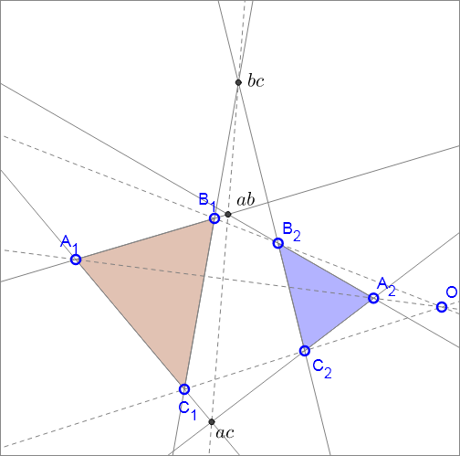
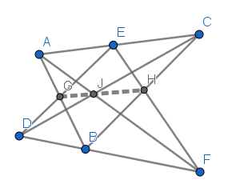

**Desargues's theorem** states that two triangles (*A*1*B*1*C*1 and *A*2*B*2*C*2) are in perspective axially (i.e. points *bc*, *ab* and *ac* are collinear) if and only if they are in perspective centrally (i.e. lines *A*1*A*2, *B*1*B*2 and *C*1*C*2 are concurrent). [1]

## Proof by Cartesian coordinates

### Collinear → Concurrent

Let's put point *ab* onto the origin, put *ac* and *bc* onto y-axis, and denote 6 lines of 2 triangles as:

Then we get 6 vertices:

Then we denote lines *A*1*A*2, *B*1*B*2 and *C*1*C*2 as:

Finally, we calculate the determinant of 9 coefficients of these 3 lines and get:

which means *A*1*A*2, *B*1*B*2 and *C*1*C*2 are concurrent. □ [2]

### Concurrent → Collinear

Let's put concurrent point *O* onto the origin, put *A*1*A*2 onto x-axis, and denote lines *A*1*A*2, *B*1*B*2 and *C*1*C*2 as:

and 6 vertices are:

Then we denote 6 lines of 2 triangles as:

Finally, we get *ab*, *ac* and *bc*:

which are collinear, i.e.

 □ [3]

## Proof by Homogeneous coordinates

**Homogeneous coordinates** are widely used in projective geometry. Because of the [Duality](https://en.wikipedia.org/wiki/Homogeneous_coordinates#Line_coordinates_and_duality), both point and straight line can be represented as homogeneous coordinates, and share the same form:

- A point  lies on a straight line  (i.e. a straight line passes through a point) if and only if .
- The straight line passing through two points  and  is .
- The intersection point of two straight lines  and  is .

From linear algebra point of view:

- Two points (straight lines) *A* and *B* are the same point (straight line) if and only if they are they are linear-dependent.
- Three points (straight lines) *A*, *B* and *C* are collinear (concurrent) if and only if they are linear-dependent (in other words, there exists non-zero *m* and *n* such that , this also means their 3 x 3 determinant is zero).
- Four points (straight lines) whether collinear (concurrent) or not, are always linear-dependent.

**Advantages:**

- A theorem and its dual theorem share the same proof process, so no necessary to prove twice.
- There are only additions, subtractions and multiplications during proof process, so all expressions are polynomials, which are simpler than rational functions.

**Disadvantages:**

- Each point needs 3 variables, more than Cartesian coordinates.
- Should use origin and axes carefully, because the origin and axes are dual as lines and points at infinity.

For example, to reduce number of variables, we should carefully put a regular point *P*(*a*,*b*,*c*) onto special places:

- put onto origin as *P*(0,0,1), which may not work for the dual process because line [0,0,1] denotes a line at infinity;
- put onto y-axis as *P*(0,*b*,1), which may not cover the parallel case in "3 lines are parallel or concurrent at point *P*";  
- put onto y-axis as *P*(0,*b*,*c*), which may work well.

**Tricks:**

- Both  and  represent the same point, so divide by their common factor as early as possible to simplify calculation.
- Homogeneous coordinates can be denoted as 3D vectors. The line passing through two points, or the intersection point of two lines, can be determined by [Cross Product](https://en.wikipedia.org/wiki/Cross_product). The collinearity and concurrency can be determined by [Triple Product](https://en.wikipedia.org/wiki/Triple_product).

### Proof

Because *A*1*A*2, *B*1*B*2 and *C*1*C*2 are concurrent at *O*, we have:

Then we have , so there exists a point:

which is collinear to *A*1*B*1 and *A*2*B*2, i.e. .

Analogously, we have *ac*:

and *bc*:

Finally, we get , which means *ab*, *ac* and *bc* are collinear. □ [4]

If *O*, *A*1, *B*1, *C*1 represent 4 lines, then *A*2, *B*2, *C*2 are 3 lines respectively passing through intersections *OA*1, *OB*1, *OC*1. Then *A*1 *B*1 *C*1 and *A*2 *B*2 *C*2 are 6 edges of two perspective triangles. So the above proof process also means the 3 perspective lines *G*, *H* and *J* are concurrent, which is the dual and converse theorem.

### Proof of Pappus's Theorem

**Pappus's theorem** states that given two sets of collinear points *AEC* and *DBF*, then the intersection points *G*=*AB*∩*DE*, *H*=*BC*∩*EF* and *J*=*AF*∩*CD* are collinear.

Given 4 arbitrary points *A*, *B*, *C* and *D*, from which no three points are collinear, we can denote *D* as:

*E* is collinear with *A* and *C*:

*F* is collinear with *B* and *D*:

Now let's calculate *G*, *H* and *J*.

*G* is collinear with *A* and *B*:

Take (*A*, *B*, *C*) as basis, then the coefficients' determinant of *D*, *E* and *G* should be zero because they are collinear:

Solve :

(Note that we cannot denote G again as . However,  or  are okay and they can get the same result as Eq. 1.)

Next, *H* is collinear with *B* and *C*:

And *H* is also collinear with *E* and *F*:

Solve :

Next, *J* is collinear with *C* and *D*:

And *J* is also collinear with *A* and *F*:

Solve :

Now let's calculate the coefficients' determinant of *G*, *H* and *J* from Eq. 1, 2 and 3:

which means *G*, *H* and *J* are collinear. □ [5]

If *A*, *C*, *E* represent 3 concurrent lines and *B*, *D*, *F* represent another 3 concurrent lines, then the 3 lines *G*, *H*, *J*, respectively passing through *A*∩*B* and *D*∩*E*, *B*∩*C* and *E*∩*F*, *A*∩*F* and *C*∩*D*, are concurrent, which is the [dual theorem](https://en.wikipedia.org/wiki/Pappus%27s_hexagon_theorem#Dual_theorem).

### 3D vector proof of Desargues's theorem

Denote points *O*, *A*1, *B*1, *C*1 as **O**, **A**1, **B**1, **C**1, then we have:

And we denote intersection *ab* as: [6]

Analogously, we have *ac*:

and *bc*:

Finally, we get , which means *ab*, *ac* and *bc* are collinear. □

### 3D vector proof of Pappus's Theorem

Given 4 arbitrary points **A**, **B**, **C** and **D**, then **E** and **F** can be denoted as:

Then we have:

where

After some calculations, we get , which means *G*, *H* and *J* are collinear. □

### Notes

1. Here we use the diagram from [Cut the Knot](https://www.cut-the-knot.org/Curriculum/Geometry/Desargues.shtml).
2. This complicated result can be solved by SymPy [here](projective/desargues-c1.py).
3. This complicated result can be solved by SymPy [here](projective/desargues-c2.py).
4. [Here](projective/desargues-h.py) is a proof of Desargues's theorem by homogeneous coordinates without linear algebra.
5. [Here](projective/pappus-h.py) is a proof of Pappus's theorem by homogeneous coordinates without linear algebra; [here](projective/pappus-c1.py) and [here](projective/pappus-c2.py) are proofs by Cartesian coordinates.
6. Here we should use some [vector formulas](diagrams/vector-formulas.png) (copied from the first page in John David Jackson's *Classical Electrodynamics*).