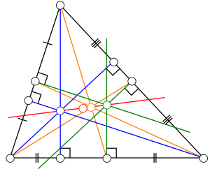

**Euler line** is a line passing through orthocenter *H*, nine-point center *N*, centroid *G* and circumcenter *O*, while *HN* = *NO* and *HG* = 2*GO*. [1]

Put *AB* onto x-axis and *C* onto y-axis and set coordinates as *A*(-*a*, 0), *B*(*b*,0), *C*(0,*c*), where *a*, *b* and *c* are positive numbers, then we get all vertices and centers:

So it's easy to prove that *HNGO* are collinear and *HN* = *NO* and *HG* = 2*GO*.

The incenter, however, doesn't lie on the Euler line, unless the triangle is isosceles. We have:

**Theorem 1** A triangle is isosceles if its incenter lies on its Euler line.

The proof (incenter lies on Euler line → isosceles) is not as easy as above because we should prove *AB* = *AC* or *AB* = *BC* or *AC* = *BC*, and exclude other possibilities.

Let's pick the centroid *G*, the orthocenter *H* (they are simpler than *N* and *O*) and the incenter *I*. The task is to proof that the determinant of collinearity has a form like:

where *D* = 0 iff *AB* = *AC*, *E* = 0 iff *AB* = *BC*, and *F* = 0 iff *AC* = *BC*.

If we choose above coordinates, the incenter will contain many square roots, which makes the determinant too difficult to be factored to *D*, *E* and *F*. So we have to run in a reverse way.

Given an incircle  and two vertices *A*(-*a*,0) and *B*(*b*,0) on x-axis, then the third vertex *C* can be determined by two edges:

where AC and BC should be tangent to the incircle. Take the incircle and *AC* as example, eliminate *x* to get the quadratic equation about *y*, then we can solve *k* by setting discriminant to zero. The root *k* = 0 is edge *AB* and the non-zero root is edge *AC*. We use  instead of  because the latter cannot cover the case that *AC* is parallel to y-axis.

A more simple way is to draw a circle orthogonal to the incircle with center *A*, such that two intersections are tangent points on *AB* (the origin) and *AC*. And we can get *BC* in the same way.

Now we have three vertices and three centers:

After some factoring work, we get the determinant of collinearity:

Obviously *F* = 0 iff *AC* = *BC*, but *D* and *E* are not obvious. So we should calculate the isosceles conditions:

which follows *D* = 0 iff *AB* = *AC*, *E* = 0 iff *AB* = *BC*, and *F* = 0 iff *AC* = *BC*.

[Here](pythagoras/euler-line.py) is the computational proof process.

[Here](https://blancosilva.github.io/post/2013/07/09/an-automatic-geometric-proof.html) is another computational proof. More proofs can be found [here](https://math.stackexchange.com/questions/97471).

### Note

1. We use the diagram from [here](https://en.wikipedia.org/wiki/Euler_line).