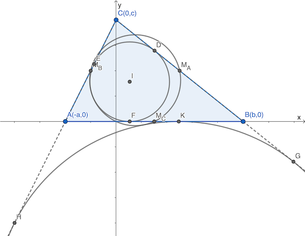

**Feuerbach's theorem** states that the nine-point circle is tangent to the three excircles of the triangle as well as its incircle.

### Start from Triangle

Put *AB* onto x-axis and *C* onto y-axis:

- The nine-point circle passes through three midpoints *M*A, *M*B, and *M*C;
- The incircle passes through *D*, *E* and *F*, where *AE* = *AF*, *BD* = *BF* and *CD* = *CE*;
- One excircle passes through *G*, *H* and *K*, where *AH* = *AK*, *BG* = *BK* and *CH* = *CG*.

So we can get the equations of these three circles. Take the nine-point circle and the incircle as example, denote their equations as:

Eliminate *y* or *x* in either of the two equations by the radical line , then we get a quadratic equation about *x* or *y*.

Because we need to prove these two circles are tangent (i.e. they have only one common point), the remaining work is just checking if the discriminant of the quadratic equation is zero.

[Here](pythagoras/feuerbach.py) is the proof process.

Another approach is to calculate radii and distance:

- The incircle is inside and internally tangent to the nine-point circle if and only if ;
- One excircle is externally tangent to the nine-point circle if and only if .

Because all of |*NI*|, *r*N, *r*I and *r*E contain square roots, which are too difficult to calculate, we need to rewrite them to simplify calculation:

 

Neither of the two approaches can tell us whether two circles are internally or externally tangent. However, the incircle is obviously inside and internally tangent to the nine-point circle, because the incircle is inside the triangle and the nine-point circle intersects all three edges; each excircle is abviously externally tangent to the nine-point circle, because each excircle is outside of the triangle.

### Start from Incircle

If we use the coordinates mentioned [here](euler-line.md) (proof of Theorem 1), it is possible to finish the proof by hand. Given an incircle:

and two vertices *A*(-*a*,0) and *B*(*b*,0) on x-axis, then *C* is . And the nine-point equation is:

The equation set of two circles (Eq. 1 and Eq. 2) has only one root (because of its zero discriminant), which proves the tangency of two circles.

An interesting thing is that Eq. 1 can also be an excircle of trangle *ABC* if we set . So the the tangency of nine-point circle and excircle is also proved.

Other proofs can be found [here](https://imomath.com/index.php?options=323) (Problem 7) and [here](https://www.cut-the-knot.org/Curriculum/Geometry/FeuerbachProof.shtml).

### Two theorems related to the Feuerbach Point

**Theorem 1** The circle through the [feet of the internal bisectors](https://mathworld.wolfram.com/IncentralTriangle.html) *I*A*I*B*I*C of a triangle *ABC* passes through the Feuerbach point.

[Here](pythagoras/feuerbach-1.py) is a computational proof *starting from incircle*.

**Theorem 2** The Feuerbach point of a triangle *ABC* is the [anti-Steiner point](https://artofproblemsolving.com/community/c1646h1025320s3_antisteiner_point) of the Euler line of the [intouch triangle](https://mathworld.wolfram.com/ContactTriangle.html) *C*A*C*B*C*C with respect to the same intouch triangle *C*A*C*B*C*C.

[Here](pythagoras/feuerbach-2.py) is a computational proof *starting from incircle*.

Other proofs of the two theorems can be found [here](https://blancosilva.github.io/post/2013/07/15/some-results-related-to-the-feuerbach-point.html) (computational) and [here](https://forumgeom.fau.edu/FG2012volume12/FG201205.pdf) (synthetic).