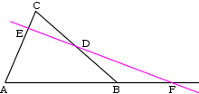
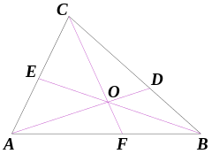

In a triangle *ABC*: *D*, *E* and *F* are three points on edges *BC*, *CA* and *AB* respectively. [1]

**Menelaus's theorem** states that *D*, *E* and *F* are collinear if and only if:

**Ceva's theorem** states that *AD*, *BE* and *CF* are concurrent if and only if:

When all points *ABCDEF* are written as homogeneous coordinates, we use some properties mentioned [here](desargues.md#proof-by-homogeneous-coordinates) and get:

Then we calculate each ratio:

Analogously, we have  and . Then we get:

Take (*A*, *B*, *C*) as basis, then *D*, *E* and *F* are collinear if and only if:

We rewrite it as , which proves Menelaus's theorem. [2]

Now let's prove Ceva's theorem.

Let *O* be a point on *AD*, then *AD*, *BE* and *CF* are concurrent if and only if both *BOE* and *COF* are collinear.

When written as homogeneous coordinates, , then *AD*, *BE* and *CF* are concurrent if and only if:

We get  by eliminating *p* and *q*. Conversely,  means there exists *p* and *q* matching the above two equations. Therefore, Ceva's theorem is proved. [3]

### Notes

1. We use the diagrams from [here](https://en.wikipedia.org/wiki/Menelaus%27s_theorem) and [here](https://en.wikipedia.org/wiki/Ceva%27s_theorem).
2. [Here](projective/menelaus-c1.py) and [here](projective/menelaus-c2.py) are proofs of Menelaus's theorem by Cartesian coordinates.
3. [Here](projective/ceva-c1.py) and [here](projective/ceva-c2.py) are proofs of Ceva's theorem by Cartesian coordinates.