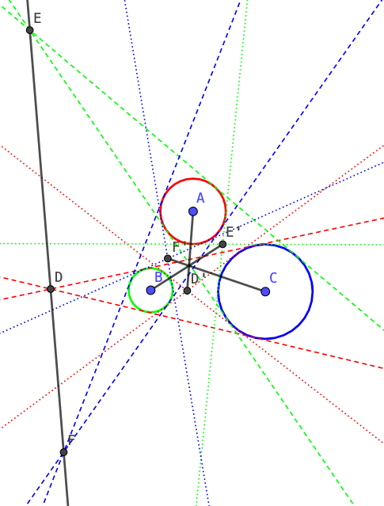

Radical center and Monge's theorem can be easily proved by Euclidean geometry. However, here we use coordinate approach to cover these cases:

- The intersections of two circles may be imaginary points, but there exists a straight line passing through them.
- The tangent lines to two circles may be imaginary lines, but their intersection point is real.

### Radical line

The radical line of two circles can be defined as the straight line passing through their intersections, whatever the two circles intersect or not. This is because any two circles can be denoted as:

Whatever the two roots are real or imaginary, we can always get a straight line by subtracting above two equations:

such that the two roots are on this line.

For example, one circle is inside another:

The two intersections are imaginary: , but the straight line passing through them are real: .

### Radical center

The radical lines of three circles are concurrent at a point called **radical center** or **power center**. [1]

Let's denote these three circles as:

Then the three radical lines are:

They are obviously concurrent because their determinant of coefficients is zero:

### Intersection of tangent lines to two circles

Here we are only interested in the intersection of two external tangent lines (later we call it *external intersection*) and the intersection of two internal ones (later we call it *internal intersection*), which means the intersection of an external one and an internal one is not considered.

Let's put two centers *A* and *B* onto y-axis, and denote these two circles as:

b,\,R\ge{r}>0)">

Because of the symmetry about y-axis, a pair of either external or internal tangent lines can be denoted as:

The intersection is (0, *h*), so we are only interested in *h* but not *k*.

When eliminating *y* with the first circle, we have:

which can be written as:

Because a tangent line has only one common point with each circle, the discriminant should be zero, i.e.

which can be written as:

Analogously, when tangent to the second circle, we have:

We get below equation by eliminating :

The first solution is:

which is less than *b*, and should be infinity if *R* = *r* (two tangent lines parallel to y-axis). So it should be the external intersection. Denote it as *H*, then we have:

The second solution is:

which is between *a* and *b*. So it should be the internal intersection. Denote it as *H'*, then we have:

For example, one circle is inside another:

The two external tangent lines are  (tangent points are  and ), and their intersection is .

The two internal tangent lines are  (tangent points are  and ), and their intersection is .

### Monge's theorem

**Monge's theorem** states that for any three circles in a plane, the intersection points of each of the three pairs of external tangent lines are collinear. This still holds even if one circle is completely inside another.

Let's apply Eq. 1 onto three external intersections *D*, *E* and *F*:

According to Menelaus's theorem, *D*, *E* and *F* are collinear.

The three internal intersections *D'*, *E'* and *F'* have a similar property. Let's apply Eq. 2 onto them:

According to Ceva's theorem, *CD'*, *BE'* and *AF'* are concurrent.

### Note

1. We use the diagram from [here](https://mathworld.wolfram.com/RadicalCenter.html).