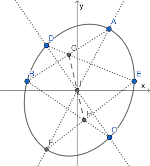

**Pascal's theorem** states that if six arbitrary points are chosen on a conic and joined by line segments in any order (here we choose *A→B→C→D→E→F*) to form a hexagon, then the three pairs of opposite sides (*AB DE*, *BC EF* and *CD AF*) of the hexagon meet at three points (*G*, *H* and *I*) which lie on a straight line. [1]

### About SymPy

Unlike the analytic geometry proof of [butterfly theorem](butterfly.md) where equations can be simplified by [Vieta's formulas](https://en.wikipedia.org/wiki/Vieta%27s_formulas), most theorems in projective geometry are too complicated to prove by analytic geometry by hand. Instead, we use [SymPy](https://en.wikipedia.org/wiki/SymPy) to do most calculations.

Here are some simple cases:

- [harmonic conjugate](projective/harmonic.py)
- [harmonic conjugate of pole and polar](projective/pole-polar.py)
- [Desargues's theorem](desargues.md)
- [Pappus's theorem](projective/pappus.py)
- [butterfly theorem](projective/butterfly.py), an analytic geometry proof without Vieta's formulas
- [Braikenridge-Maclaurin theorem](projective/braikenridge-maclaurin.py), with some tricks mentioned [here](https://math.stackexchange.com/a/4236022/919440)

However, the proof of Pascal's theorem is more complicated.

### The Proof

Let's put point *I* onto the origin, rotate the hexagon to make *BE* parallel to x-axis, denote the conic *ADBFCE* as:

and denote *AF*, *CD* and *BE* as:

#### Step 1

Two points can be solved by a conic and a straight line. However, SymPy won't tell us whether the first root denotes the point in the left or right side. So we need to guess then verify by numerical evaluation.

Assume the conic is  and the line *AF* is , we should get *A* in quadrant I and *F* in quadrant III. So we should use `F, A = solve(...)` but not `A, F = solve(...)`.

[Here](projective/pascal1.py) we get 6 points:

#### Step 2

Without further simplification, SymPy can hardly solve the intersections G and H. (This may be due to too many calculations during cancellation of  and *x*.[2] I don't know if Mathematica or other alternatives can do this.) So we need to replace all square roots with:

Then the 6 points are simplified as:

[Here](projective/pascal2.py) we solve the G and H and get the expression  to check if G, H and I are collinear.

The numerator of this expression can be denoted as *S*×*T*−*U*×*V*, with both *S* and *U* containing 69 terms, and both *T* and *V* containing 125 terms. We just need to prove the numerator equal to 0.

#### Step 3

[Here](projective/pascal3.py) we expand the numerator *S*×*T*−*U*×*V* to 432 terms (cancelled from 69×125×2 terms).

#### Step 4

There are many *P*2, *Q*2 and *R*3 in the above expanded numerator. So we can replace them with:

This can be done by replacing `P**2`, `Q**2` and `R**3` with `P2`, `Q2` and `R2*R` in text editor.

[Here](projective/pascal4.py) shows the final result equal to 0, which means G, H and I are collinear.

### Notes

1. Here we use the diagram from [Cut the Knot](https://www.cut-the-knot.org/Generalization/OverlookedPascal.shtml).
2. More explanations can be found [here](https://docs.sympy.org/latest/tutorial/simplification.html).