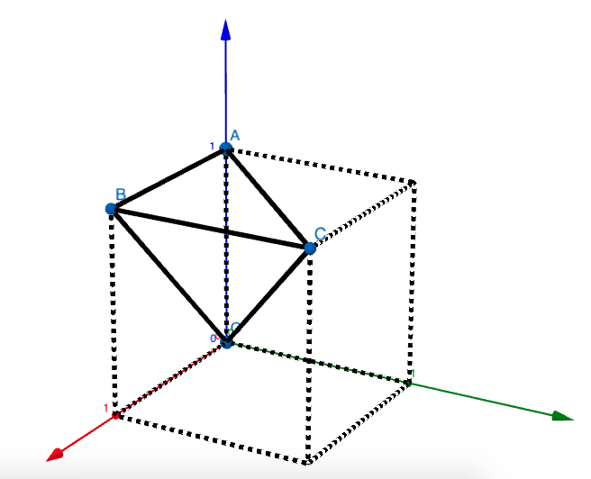

Polya noted the solution for Problem 8 (Axes of a Cube) in *How to Solve It*:

> ... the "average width" of the cube, which is, in fact, 3/2 = 1.5

I guessed two definitions of the "average width":

### Diameter equivalent to an isovolumic sphere

According to the volume of cube and sphere:

the solution is:

### Integral over all directions

Here we use spherical coordinates:

Then the average radius can be defined as:

Here let's choose a cube with edge length 2, centered at the origin, then calculate the average radius (half of width) of one of the symmetric 48 parts of the cube:

Then this part of the cube is a tetrahedron with 4 planes:

- OAB: *y* = 0, or *φ* = 0
- OAC: *x* = *y*, or *φ* = *π*/4
- OBC: *x* = *z*, or cos*φ* sin*θ* = cos*θ*
- ABC: *z* = 1, or *r* cos*θ* = 1

So we have:

Because of the symmetry, we can just integrate the average radius of the tetrahedron:

Let's calculate the integral:

 (0 ≤ *φ* ≤ *π*/4)

Although the antiderivative of this function doesn't look analytic, we can get the numeric solution:

This is close to the isovolumic-sphere definition but far different from Polya's note.