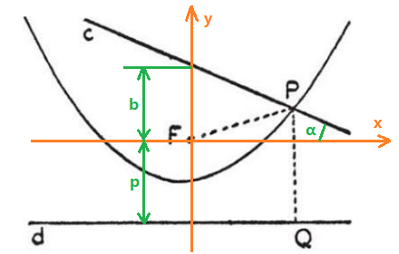

The problem is in section **Definition** in *How to Solve It*:

> Construct the point of intersection of a given straight line and a parabola which the focus and the directrix are given.

This is a [Straightedge and Compass Construction](https://en.wikipedia.org/wiki/Straightedge_and_compass_construction) problem. Although it is impossible to construct a parabola by straightedge and compass, the points of intersection can be found:

> Construct a point *P* on the given straight line *c* at equal distances from the given point *F* and the given straight line *d*.

However, the solution is not given in this book. I'd like to give a coordinate solution, which can be converted to straightedge and compass construction.

### Coordinate Solution

We put *F* onto the origin of Cartesian coordinates, then get the equations for *P*(*x*,*y*):

The solutions are:

Here let , then  can be constructed by [Geometric Mean Theorem](https://en.wikipedia.org/wiki/Geometric_mean_theorem).

#### Special Cases

There is only a tangent point if *q* = 0, and no intersection or tangent points if *q* < 0.

If *c* is a vertical line, then the equation for *P*(*x*,*y*) (*x* is the distance from *F* to *c*) is . The solution is .

### Synthetic Solutions

Synthetic solutions can be found [here](https://math.stackexchange.com/questions/793125).