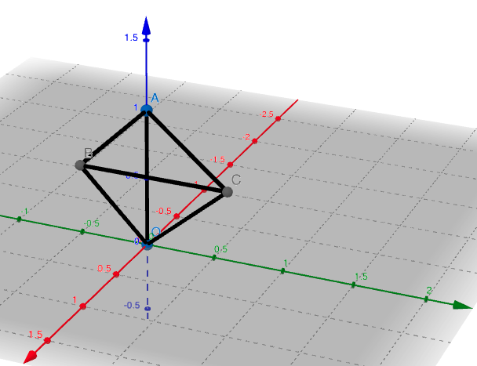

Note to Problem 20 in *How to Solve It*:

> ... the "average width" of the cube, which is, in fact, 3/2 = 1.5

Let's calculate the average radius (have of width) of one of the symmetric 1/48 parts of the cube:

Let's set the radius of the inscribed sphere is 1, then this part of the cube is a tetrahedren with these planes:

- OAB: *y* = 0
- OAC: *x* = *y*
- OBC: *x* = *z*
- ABC: *z* = 1

We use spherical coordinates

to integral the average radius:

