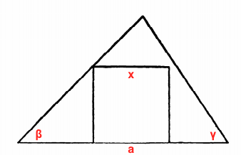

The problem is in section 18 (part I) in *How to Solve It*:

> Inscribe a square in a given triangle. Two vertices of the square should be on the base of the triangle, the two other vertices of the square on the two other sides of the triangle, one on each.

The triangle can be determined by a side *a* and its two angles *β* and *γ*. The sides of inscribed square are *x*. Then we have:

which can be written to:

Then construct *x* by [Intercept Theorem](https://en.wikipedia.org/wiki/Intercept_theorem).