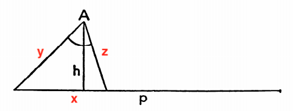

The problem is in section **Auxiliary Elements** in *How to Solve It*:

> Construct a triangle, being given one angle, the altitude drawn from the vertex of the given angle, and the perimeter of the triangle.



### Solution

The equations are:


Replace with *u*<sup>2</sup> = *yz* and 2*v* = *y* + *z* (*u* and *v* are geometric and arithmetic mean of *y* and *z*), then the equations can be simplified to:


The solutions are:


Here let *q* = 2(*h* + *h* cos *A* + *p* sin *A*), then *r* = *p*<sup>2</sup> / *q* can be constructed by [Intercept Theorem](https://en.wikipedia.org/wiki/Intercept_theorem), and  can be constructed by [Geometric Mean Theorem](https://en.wikipedia.org/wiki/Geometric_mean_theorem). Finally, we have:


### Verification

Here we use [SymPy](https://en.wikipedia.org/wiki/SymPy) to verify our result:

```python
from sympy import *

h, p, A = symbols("h p A")
u = sqrt(h * p * p / 2 / (h + h * cos(A) + p * sin(A)))
v = (p - u * u * sin(A) / h) / 2
y = v + sqrt(v * v - u * u)
z = v - sqrt(v * v - u * u)
x = y * z * sin(A) / h
print("x + y + z =", simplify(x + y + z))
x = sqrt(y * y + z * z - 2 * y * z * cos(A))
print("x + y + z =", simplify(x + y + z))
```

We get:

```
x + y + z = p
x + y + z = (-p**2*sin(A)/2 + (4*p + 2*sqrt(p**4*sin(A)**2/(h*cos(A) + h + p*sin(A))**2))*(h*cos(A) + h + p*sin(A))/4)/(h*cos(A) + h + p*sin(A))
```

The verification of  looks well.

However, the verification of  looks a bit complicated. So we should continue simplifying it:

```python
from sympy import *

h, p, A = symbols("h p A", positive=True)
xyz = (-p**2*sin(A)/2 + (4*p + 2*sqrt(p**4*sin(A)**2/(h*cos(A) + h + p*sin(A))**2))*(h*cos(A) + h + p*sin(A))/4)/(h*cos(A) + h + p*sin(A))
xyz = refine(xyz, Q.positive(sin(A)))
xyz = refine(xyz, Q.positive(h + h * cos(A) + p * sin(A)))
print("x + y + z =", simplify(xyz))
```

Finally we get `x + y + z = p`.

### Special Cases

If , then we get an isosceles triangle .

If , then the triangle cannot be constructed.