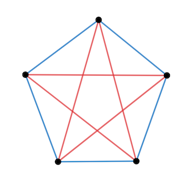

## Friends and Strangers

> In any party of six people either at least three of them are (pairwise) mutual strangers or at least three of them are (pairwise) mutual acquaintances.

The simple proof by pigeonhole principle is shown [here](https://en.wikipedia.org/wiki/Theorem_on_friends_and_strangers#Sketch_of_a_proof) and [here](https://en.wikipedia.org/wiki/Ramsey's_theorem#R%283,_3%29_=_6).

However, I'd like to prove it with by brute force. As mentioned [here](https://en.wikipedia.org/wiki/Theorem_on_friends_and_strangers#Conversion_to_a_graph-theoretic_setting), the only thing is to exhaust 215 colorings and to find mutual friends / strangers in each coloring. Considering the symmetry, only 78 colorings are necessary to check.*How to prove?*

### Proof by Program

[ramsey.py](ramsey.py) tries to find out colorings (where mutual friends / strangers are not found) for `R(3,3)=N`. It has two big nested loops:

1. Loop for 2M [colorings](ramsey.py#L15), where `M=N*(N-1)/2` is the number of [edges](ramsey.py#L14);
2. Loop for `L=C(N,3)` [cliques](ramsey.py#L17).

The program found no coloring (without monochromatic cliques) for `R(3,3)=6`, and found 12 colorings for `R(3,3)>5` (change [N](ramsey.py#L13) to 5), which matched our expectation:

||         |
|:------------------------------:|:---------------------------------------:|
|2 colorings (swap red and blue) |10 colorings (5 directions, red <-> blue)|
