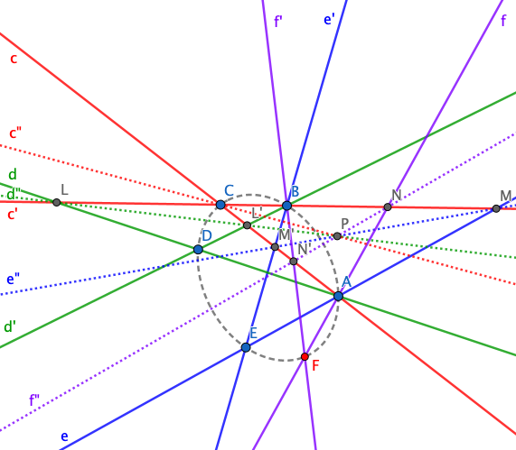

The **[Steiner Conic](https://en.wikipedia.org/wiki/Steiner_conic)** is an alternative definition of a conic: Given two pencils *P*(*A*), *P*(*B*) of lines at two points *A*, *B* (all lines containing *A* and *B* resp.) and a projective but not perspective mapping *π* of *P*(*A*) onto *P*(*B*), then the intersection points of corresponding lines form a non-degenerate projective conic section.

In the above figure,

Therefore, by given lines *cdec'd'e'* or points *ABCDE*, and by given an arbitrary line *f* passing through *A*, we can construct line *f'* or point *F* by these steps:

1. 
2. 
3. 
4. 

This is the construction of Steiner *point* conic. Analogously, we can construct the Steiner *line* conic according to the principle of duality.

### Steiner conic and Quatric curve

#### Steiner conic → Quatric curve

The Steiner conic follows the quatric curve equation . Let's denote lines *cdec'd'e'* in homogeneous coordinate:

Point  follows , , and *NN'P* are collinear, and *N* and *N'* can be calculated by step 1 and 2 in the above the construction. So we can get the equation eventually:

#### Quatric curve → Steiner conic

### Pascal's theorem