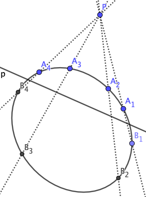

The **[Steiner Conic](https://en.wikipedia.org/wiki/Steiner_conic)** is an alternative definition of a conic: Given two pencils *P*(*A*), *P*(*B*) of lines at two points *A*, *B* (all lines containing *A* and *B* resp.) and a projective but not perspective mapping *π* of *P*(*A*) onto *P*(*B*), then the intersection points of corresponding lines form a non-degenerate projective conic section.

In the above figure,

Therefore, by given lines *cdec'd'e'* or points *ABCDE*, and by given an arbitrary line *f* passing through *A*, we can construct line *f'* or point *F* by these steps:

1. 
2. 
3. 
4. 

This is the construction of Steiner *point* conic. Analogously, we can construct the Steiner *line* conic according to the principle of duality.

In this page, we simplify the projective mapping  as the invariant of cross-ratio, i.e. .

### Steiner conic → Quadric curve

The Steiner conic follows the quadric curve equation . Let's denote lines *cdec'd'e'* in homogeneous coordinate:

Then get the equation about point  by the relation :

[Here](projective/steiner-conic-h1.py) is the calculation process.

According to the duality, this process also shows that the Steiner *line* conic follows the quadric curve (the envelope of a set of straight lines) equation.

### Five points determine a conic

[Here](projective/steiner-conic-h2.py) we calculate lines *cdec'd'e'* by given points *ABCDE*, and get the similar result, although the time is longer and the equation is more complicated.

[Here](projective/steiner-conic-h3.py) we get the same result by a rule that [five points determine a conic](https://en.wikipedia.org/wiki/Five_points_determine_a_conic):

 

According to the duality, these two processes also shows that five straight lines determine a line conic.

### Quadric curve → Steiner conic

Conversely, any quadric curve is a Steiner conic. We only need to prove that for any 6 points *ABCDEF* on a quadric curve, .

WLOG, we can put *A* onto origin and *AB* onto y-axis, and denote the quadric curve as . For any line  passing through *A*, we can get the other intersection of the line and the quadric curve .

[Here](projective/steiner-conic-h4.py) is the proof process.

To prove the dual fact, we can put line *A* onto x-axis and point *AB* onto origin, and denote the quadric curve (the envelope of a set of straight lines) as . For any point (*x*,0,*z*) (*z*=0 means the point at infinity) lying on *A*, we can get the other tangent line .

[Here](projective/steiner-conic-h5.py) is the proof process.

### Pascal's theorem and Brianchon's theorem

The proof of Pascal's theorem on a Steiner conic is much simpler than on a quadric curve, because only incidence relations of points and straight lines should be considered, just like Desargues's theorem and Pappus's theorem.

[Here](projective/pascal-brianchon-steiner-h.py) and [here](projective/pascal-brianchon-steiner-v.py) are the computational proofs.

According to the duality, this process also proves Brianchon's theorem.

### Braikenridge-Maclaurin theorem

Similarly, the proof of Braikenridge-Maclaurin theorem (which is the converse of Pascal's theorem) on a Steiner conic is also much simpler.

[Here](projective/braikenridge-maclaurin-steiner-h.py) and [here](projective/braikenridge-maclaurin-steiner-v.py) are the computational proofs.

[Here](projective/braikenridge-maclaurin-steiner-h.py) and [here](projective/braikenridge-maclaurin-steiner-v.py) are the computational proofs.

This process also proves its dual theorem (which is also the converse of Brianchon's theorem).

Braikenridge-Maclaurin theorem provides another construction of a conic: by given points *ABCDE* and an arbitrary line *f* passing through *A*, we can construct point *F* by , where line *GHJ* is a Pascal line.

Braikenridge-Maclaurin construction (additional 6 lines and 3 intersections) is simpler than Steiner construction (additional 10 lines and 7 intersections, note that *c"* is not necessary).

### Projective mapping, Involution, Pole and Polar

Let's define the projective mapping of two point sets *A*1*A*2... and *B*1*B*2... on a conic *Γ*  as , where *P* and *Q* are two arbitrary points on *Γ*.

Because *P* and *Q* can be *B**i* and *A**j*, all  lie on one straight line *p*, according to Pascal's theorem. We call this line *p* the *projective axis*.

A projective mapping is an **[involution](https://en.wikipedia.org/wiki/Involution_(mathematics)#Projective_geometry)** if and only if all *A**i**B**i* meet at the same point *P*. [1] We call this involution a perspective mapping, and *P* is the perspective center.

In an involution on a conic *Γ*, we call the perspective center *P* the **pole** of the projective axis *p*, and call *p* the **polar** of *P*, with respect to *Γ*.

### Note

1. [Here](projective/conic-involution-v1.py) and [here](projective/conic-involution-v2.py) are the proofs.