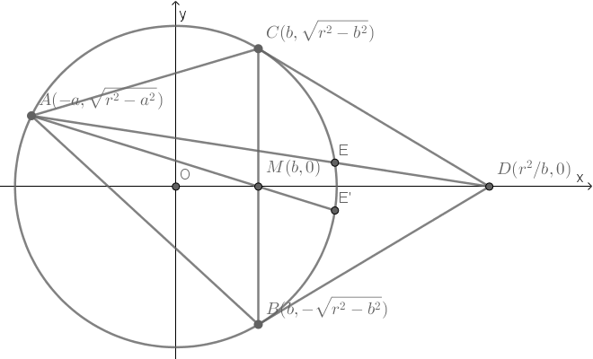
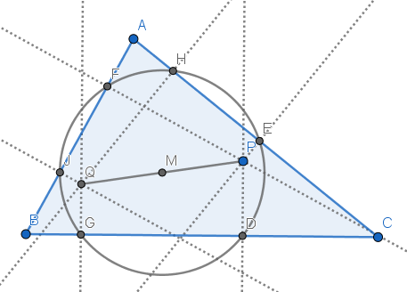

### Construction of the Symmedian

Construct a point *D* by intersecting the tangents from B and C to the circumcircle of triangle *ABC*, then AD is the **symmedian** of the triangle ABC, which implies ∠*BAM* = ∠*CAD*, where *AM* is the median.

Let's put the circumcenter onto the origin, rotate the triangle to make *BC* parallel to y-axis, then we get the equations of the circumcircle and line *AD*:

We can solve intersection *E* by eliminating *y*:

Here we use Vieta's formula because we already know a root *x*A:

Reflect *E* about x-axis at *E'* to make ∠*BAE'* = ∠*CAE*, then we have  and

After some calculations, we get:

which implies *AME'* are collinear, so ∠*BAM* = ∠*CAD*. □

Other proofs can be found [here](https://en.wikipedia.org/wiki/Symmedian#Construction_of_the_symmedian).

### Construction of the Isogonal Conjugate

*P* is an arbitrary point in triangle *ABC*. Construct the pedal trangle *DEF* and its circumcenter *M*. Reflect *P* about *M* at point *Q*, then *Q* is the **Isogonal Conjugate** of *P*.

[Here](pythagoras/isogonal.py) proves  but not , because *P* may be a point outside the triangle, where we may have  instead of .

Other proofs can be found [here](https://blog.evanchen.cc/2014/11/30/three-properties-of-isogonal-conjugates/) (section 3) and [here](http://www.cut-the-knot.org/Curriculum/Geometry/OrthologicPedal.shtml).